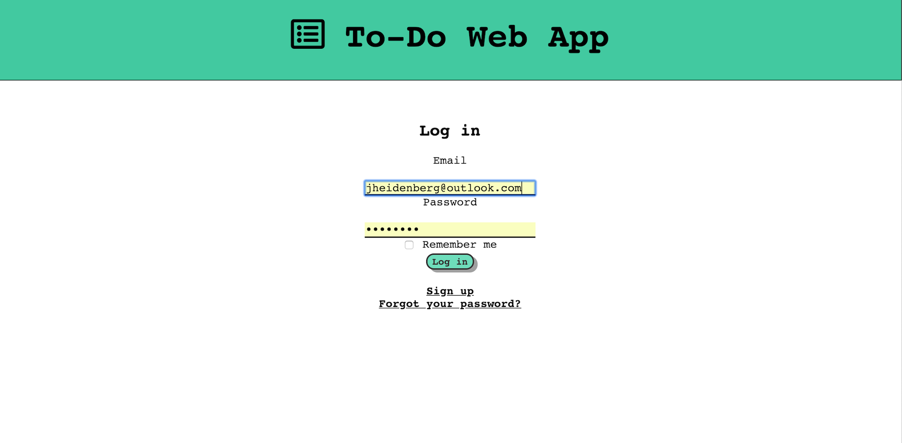

# README

* Rails 5.2.2
* Basic CRUD functionality

Features:

* User Authentication with devise
* Icons using fontawesome
* Simple validations
* User feedback

* Application deployed at https://shielded-temple-76692.herokuapp.com/todos

